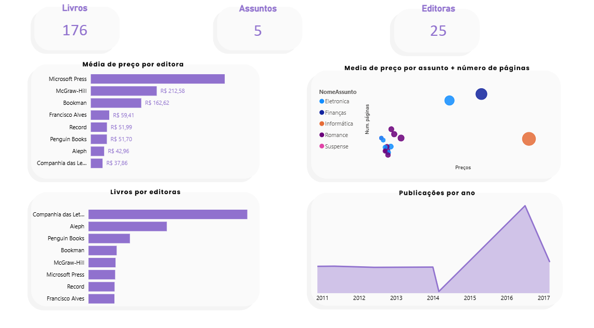
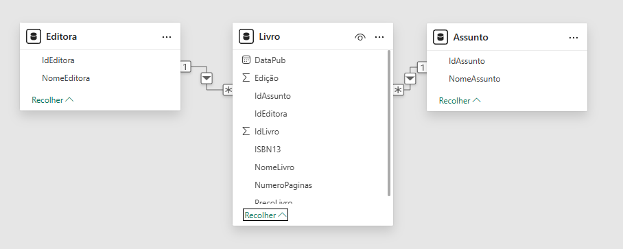

Library Business Intelligence
Overview

This project demonstrates a complete Business Intelligence workflow using SQL and Power BI to analyze a library dataset.

Technologies
SQL (relational modeling, joins, views)
Power BI (data modeling, DAX, dashboards)
Data Model

The database was modeled using relational principles, with tables for:
Books
Publishers
Subjects

Views were created in SQL to generate an analytical layer consumed by Power BI.

Analysis

The dashboard provides insights such as:
Book price distribution
Number of pages vs price
Books by publisher
Books by subject

Goal
Showcase practical SQL and Power BI skills for a Data / BI internship.

## Dashboard

## Data Model

## Key Analysis

